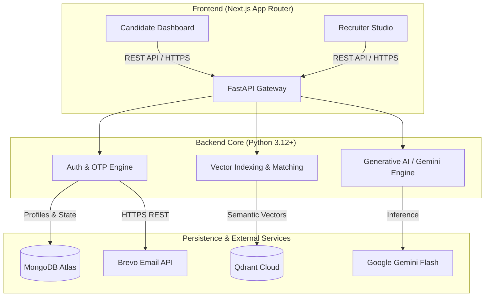
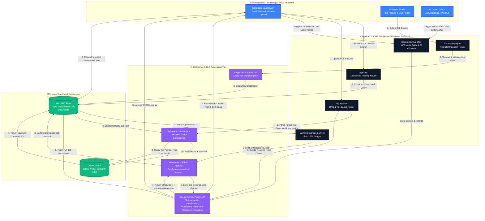

<div align="center">

# 🚀 Job Dekho

### AI-Powered Job Board & Career Ecosystem

**A production-grade full-stack recruitment platform** engineered with a FastAPI asynchronous backend, Next.js App Router frontend, MongoDB Atlas for structured persistence, Qdrant Cloud for semantic retrieval, local sentence-transformer embeddings, and Google Gemini for job intelligence, resume analysis, and career assistance.

[](#)
[](#)
[](#)
[](#)
[](#)
[](#-deployment)
[](#-license)

**🔗 Live App:** [ai-job-board-frontend.onrender.com](https://ai-job-board-frontend.onrender.com) &nbsp;|&nbsp; **⚙️ API:** [ai-job-board-backend-izko.onrender.com](https://ai-job-board-backend-izko.onrender.com) &nbsp;|&nbsp; **📄 API Docs:** [/docs](https://ai-job-board-backend-izko.onrender.com/docs)

**🤖 AI Pipeline:** Raw Job Data → Cleaning → Batch Gemini Extraction → Strict JSON → Markdown Formatting → MongoDB → Vector Index

**🎥 Explanation Video:** _[link pending — to be added before final submission]_

</div>

---

## 📑 Table of Contents

- [Architecture & System Overview](#-architecture--system-overview)
- [Feature Summary](#-feature-summary)
- [Tech Stack](#️-tech-stack)
- [Visual System Workflow](#-visual-system-workflow)
- [Detailed Data Flow](#-detailed-data-flow)
- [Core Component Breakdown](#-core-component-breakdown)
- [Repository Directory Structure](#-repository-directory-structure)
- [Engineering Workflows & How the AI Components Work](#️-engineering-workflows--how-the-ai-components-work)
- [Key Engineering Decisions](#-key-engineering-decisions)
- [Known Limitations & Trade-offs](#️-known-limitations--trade-offs)
- [Getting Started & Local Setup](#-getting-started--local-setup)
- [Deployment (Render)](#️-deployment)
- [Environment Variables Reference](#-environment-variables-reference)
- [Roadmap](#️-roadmap)
- [License](#-license)

---

## 🏛️ Architecture & System Overview

**Job Dekho** is an AI-powered recruitment platform designed around two connected workflows and one shared intelligence layer. The system combines structured job data processing, semantic retrieval, and generative AI so that messy job descriptions can be converted into consistent, searchable, and candidate-friendly information.

The platform is split into dual production workflows:

- 🧑‍💼 **Candidate Workspace** — 1-click apply, resume parsing, ATS scoring, and an interactive AI Career Coach.
- 🏢 **Recruiter Studio** — deep talent indexing, corporate GST verification, job publishing, and recruitment pipeline analytics.

Both workflows are backed by the same intelligence core: structured job attributes are persisted in MongoDB, while job descriptions and resumes can be embedded into a shared vector space for meaning-based matching rather than brittle keyword-only search.

### 🧠 AI Data Intelligence Layer

The platform also contains a batch-oriented job intelligence pipeline for transforming unstructured or inconsistently formatted job descriptions into normalized dataset records.

**Raw Job Description → AI Extraction → Validation → Structured JSON → Human-readable Markdown → Persistent Storage → Semantic Indexing**

The extraction layer is intentionally schema-driven. Gemini is instructed to return deterministic fields such as:

- `extracted_skills`
- `job_category`
- `inferred_experience`
- `formatted_description`

This separation keeps **raw source data**, **normalized structured fields**, **presentation-ready Markdown**, and **semantic vectors** available for different downstream use cases.

### 📦 Normalized Job Data Contract

A normalized record follows a predictable structure so downstream services can consume the same fields consistently:

```json
{
  "extracted_skills": ["Python", "FastAPI", "MongoDB"],
  "job_category": "Backend Development",
  "inferred_experience": "Entry Level",
  "formatted_description": "**Responsibilities:**\n- ...\n\n**Requirements:**\n- ..."
}
```

The contract is intentionally narrow: the model extracts what the source supports, normalizes duplicates and equivalent skill names, and uses `Not Specified` rather than inventing missing information. This makes the output suitable for MongoDB persistence, UI rendering, structured filtering, and later semantic indexing.

---

## ✅ Feature Summary

| # | Requirement | Status | Where |
| --- | --- | --- | --- |
| 1 | Multi-platform job data (source dropdown, filtering, storage) | ✅ Working — dropdown filters by source (LinkedIn, Naukri, Indeed, Internshala, + others); listing-level dedup still a gap, see [Known Limitations](#-known-limitations--trade-offs) | `jobs.py`, `employer.py` |
| 2 | AI-based job classification & tagging | ✅ Working — batch Gemini extraction converts raw descriptions into normalized skills, category, experience level, and formatted Markdown | `employer.py` |
| 3 | Resume-based personalized recommendations | ✅ Working | `resume.py`, `vector_db.py` |
| 4 | Conversational AI Job Assistant (user-supplied Gemini key) | ✅ Working | `chat.py`, `AICareerCoach.tsx` |
| 5 | Working, publicly deployed prototype | ✅ Working — frontend and backend deployed on Render | Render — links above |

Additional platform features beyond the core assignment scope:
- Candidate 1-click apply, saved jobs, and application tracking
- Recruiter GST-verified onboarding and job requisition publishing
- ATS-style resume match scoring and AI-generated cover letters
- OTP-based authentication via Brevo (HTTPS, not SMTP)

---

## 🛠️ Tech Stack

<table>
<tr>
<td valign="top" width="33%">

**Frontend**
- Next.js 14+ (App Router)
- TypeScript
- Tailwind CSS
- Component-based glassmorphism UI

</td>
<td valign="top" width="33%">

**Backend**
- FastAPI (async, Python 3.12+)
- Uvicorn ASGI server
- Pydantic data models
- Modular router architecture

</td>
<td valign="top" width="33%">

**AI / ML**
- Google Gemini (`gemini-3.5-flash`)
- `sentence-transformers/all-MiniLM-L6-v2`
- FastEmbed (local CPU embeddings)
- PyPDF (resume text extraction)

</td>
</tr>
<tr>
<td valign="top" width="33%">

**Data & Storage**
- MongoDB Atlas + PyMongo
- Qdrant Cloud (vector search)

</td>
<td valign="top" width="33%">

**Infra & DevOps**
- Docker (backend containerization)
- Render (production hosting)
- Auto-deploy on `main` (CI/CD)

</td>
<td valign="top" width="33%">

**Third-Party Services**
- Brevo (transactional email / OTP)
- Mock Stripe (checkout flow)

</td>
</tr>
</table>

---

## 📊 Visual System Workflow

High-level view of how data moves between the Next.js frontend, FastAPI backend routers, vector database, document store, and external AI/email APIs:



---

## 🔬 Detailed Data Flow

A deeper, request-level view showing exactly how a job posting is ingested and indexed, how a candidate's resume gets matched against live listings, and how the AI Career Coach and premium tools sit on top of the same Gemini engine:



**Notable design details visible in this flow:**
- Job ingestion and job search **do not share a code path** — postings are cleaned and vectorized once at write-time (`API_Emp`), while search reads pre-cleaned documents directly from MongoDB (`API_Jobs`), keeping search latency independent of NLP normalization cost.
- The batch AI enrichment layer is intentionally separated from request-time ingestion so large job datasets can be processed without making the employer-facing API wait for Gemini.
- The extraction contract is **schema-first**: Gemini is expected to return structured fields for skills, category, experience, and formatted Markdown rather than an uncontrolled natural-language response.
- Resume matching is **tiered**: the vector query step retrieves the top 2 matches for free-tier users and the top 10 for Pro, before either set is handed to Gemini for scoring and pitch generation.
- The **AI Career Coach** and in-dashboard premium actions (ATS score, cover letter, auto-apply) converge on the same `/api/premium` + chat router, which injects context before calling the same underlying Gemini engine used for resume diagnostics — one LLM integration point, multiple product surfaces.

---

## 🧩 Core Component Breakdown

| Component Layer | Technologies & Modules | Responsibilities & Functions |
| --- | --- | --- |
| **API Gateway & Routing** | FastAPI, Uvicorn, CORS Middleware (`main.py`) | Initializes application startup hooks, registers modular routers (`auth`, `jobs`, `resume`, `chat`, `user`, `premium`, `employer`), and manages cross-origin resource sharing. |
| **Vector Intelligence Layer** | Qdrant Cloud API, FastEmbed (`sentence-transformers/all-MiniLM-L6-v2`) | Generates local CPU-optimized embeddings from job requirements and candidate profiles, syncing high-dimensional vectors with Qdrant Cloud. |
| **Generative AI Engine** | Google Gemini (`gemini-3.5-flash` variants), PyPDF | Handles structured job-description extraction, classification, experience inference, Markdown normalization, resume diagnostics, skill-gap analytics, ATS-style scoring, cover letter generation, and mock interview assistance. |
| **Transactional Email System** | Brevo HTTPS REST API (`requests.post`) | Delivers secure 6-digit verification and password-reset OTP codes via standard HTTPS (Port 443), bypassing cloud SMTP network restrictions. |
| **Persistence Layer** | MongoDB Atlas, PyMongo | Stores structured user accounts, corporate profiles, active job listings, saved favorites, and audit notifications. |
| **User Interface** | Next.js 14+ (App Router), Tailwind CSS | Provides a responsive glassmorphism UI featuring dynamic category filters, real-time telemetry dashboards, and floating widget integration. |

---

## 📂 Repository Directory Structure

```text
ai-job-board/
├── app/                          # Next.js App Router — all client-facing UI
│   ├── AICareerCoach.tsx         # Floating AI assistant widget, session-aware chat
│   ├── CandidateDashboard.tsx    # Job feed, multi-filter sidebar, profile & interview hub
│   ├── EmployerAuth.tsx          # Employer-side authentication flow
│   ├── EmployerDashboard.tsx     # Recruiter metrics, job publisher, pipeline tracking
│   ├── LoginForm.tsx             # Secure login & OTP-based password reset
│   ├── RegisterForm.tsx          # Candidate/employer registration flow
│   ├── UpdateUserDetails.tsx     # Modal for editing candidate professional attributes
│   ├── favicon.ico
│   ├── globals.css               # Tailwind base styles & design tokens
│   ├── layout.tsx                # Root layout, fonts, metadata
│   └── page.tsx                  # Landing page, typewriter hero, portal mode switcher
│
├── backend/                      # FastAPI service — all business & AI logic
│   ├── routers/                  # Modular route handlers, one domain per file
│   │   ├── __init__.py
│   │   ├── auth.py               # Registration, OTP verification, password recovery
│   │   ├── chat.py                # AI Career Coach conversational backend
│   │   ├── employer.py           # Employer onboarding, GST validation, job publishing + vector upsert
│   │   ├── jobs.py               # Job search, keyword parsing, multi-filter logic
│   │   ├── premium.py            # ATS scoring, cover letter generation, mock checkout
│   │   ├── resume.py             # PDF parsing & AI resume optimization
│   │   └── user.py               # Candidate profile CRUD, applications, saved listings
│   ├── Dockerfile                # Backend container build definition
│   ├── database.py                # MongoDB client configuration & collection mapping
│   ├── main.py                    # FastAPI entry point, CORS middleware, startup hooks
│   ├── models.py                  # Pydantic schemas / data models
│   ├── normalize_jobs.py          # Batch normalization utility for job listing data
│   ├── requirements.txt           # Production Python dependencies
│   ├── seed_mongo_fast.py         # Fast MongoDB seeding script for local/dev data
│   ├── updated_jobs_data.json     # Seed dataset for job listings
│   └── vector_db.py               # FastEmbed model loader & Qdrant collection init
│
├── public/                       # Static assets served by Next.js
│   ├── file.svg
│   ├── globe.svg
│   ├── next.svg
│   ├── vercel.svg
│   └── window.svg
│
├── scripts/                      # One-off data & maintenance scripts
│   ├── enrich/jobs.mjs           # Job listing enrichment script
│   └── seed.mjs                  # Database seeding script (Node)
│
├── .gitignore
├── Dockerfile                    # Root-level container build (frontend or unified build)
├── README.md
├── eslint.config.mjs             # Linting rules
├── next.config.ts                # Next.js build configuration
├── package-lock.json
├── package.json
├── postcss.config.mjs            # Tailwind/PostCSS pipeline config
├── tsconfig.json                 # TypeScript compiler configuration
└── workflow-diagram.png          # Exported architecture diagram
```

---

## ⚙️ Engineering Workflows & How the AI Components Work

### 1. Autonomous Batch AI ETL & Job Description Intelligence

- New or unprocessed job records can be marked with an AI-processing state so heavy LLM work is decoupled from the user-facing publishing request.
- A scheduled batch process collects unprocessed records and sends them to Gemini using a strict extraction contract.
- The model returns machine-readable JSON with:
  - `extracted_skills`
  - `job_category`
  - `inferred_experience`
  - `formatted_description`
- The extraction prompt explicitly prevents hallucinated skills or unsupported requirements, removes duplicate skills, normalizes equivalent technology names, and returns `Not Specified` when evidence is insufficient.
- The formatted description is rewritten as production-grade Markdown with section headers, bullet points, and paragraph breaks while preserving the original meaning.
- The normalized result can then be persisted alongside the raw description, giving downstream search/filtering/recommendation features clean structured fields without destroying source text.

### 2. Multi-Platform Job Source Filtering

- Job listings carry a `source` field identifying which platform they originated from (Job Dekho native postings, LinkedIn, Naukri, Indeed, Internshala, and a few additional aggregated sources).
- The **Job Portal** filter in the UI (`jobs.py`) queries MongoDB scoped to the selected source, so switching the dropdown returns only listings from that platform rather than filtering client-side against the full dataset.
- This sits alongside the other structured filters (date, experience, location, skill), all of which compose into a single compound query against MongoDB.

### 3. Semantic Vector Search & Indexing Pipeline

- When an employer publishes a vacancy via the Recruiter Studio (`employer.py`), the description is pre-processed using high-speed regex normalizers (`fast_clean_description`) to format headers and bullet points.
- The system constructs a structured context string (`build_job_text`) which is vectorized locally via `sentence-transformers/all-MiniLM-L6-v2` (`generate_embedding`).
- The vector is pushed to **Qdrant Cloud** linked via a deterministic UUID payload (`uuid.uuid5`), ensuring idempotent upserts and zero-drift indexing during semantic candidate matching.

### 4. Generative AI Resume Diagnostics & Skill-Gap Analysis

- Candidate resumes are parsed via PyPDF, matched against live job requirements through the vector layer, and analyzed through Google Gemini models (`user.py`, `resume.py`).
- The AI engine evaluates the gap between resume content and target job requirements to surface missing high-demand skills and actionable career growth advice.
- The **AI Career Coach** (`AICareerCoach.tsx`) maintains contextual memory across dialogue sessions to deliver real-time mock interviews and tailored guidance.

### 5. Conversational AI Job Assistant — User-Supplied API Key

- The AI Job Assistant does **not** rely on a shared backend Gemini key for its conversational features. Users provide their own Gemini API key through the frontend, which is used only for the duration of the session to authenticate calls made on their behalf.
- This follows the assignment's security requirement directly: no persistent storage of user-supplied credentials, and no shared cost/rate-limit surface across users.
- The assistant answers questions like job-fit suitability, missing skills, job description explanation, and resume improvement suggestions, grounded in the candidate's parsed resume and the selected job's data.

### 6. Secure Cloud Communication

- To prevent email failures caused by cloud hosting firewalls blocking traditional SMTP ports, all outbound notifications utilize **Brevo's REST API** over standard HTTPS.
- Credentials and tokens are isolated through environment variables (`MONGODB_URI`, `QDRANT_API_KEY`, `GEMINI_API_KEY`, `BREVO_API_KEY`) and are never committed to source control.

---

## 🧠 Key Engineering Decisions

Notable trade-offs made while building this system, and the reasoning behind each:

| Decision | Why |
| --- | --- |
| **Local embeddings (FastEmbed) instead of a hosted embedding API** | Removes per-request network latency and cost for high-volume indexing. Runs on CPU, so the semantic layer does not require a GPU dependency. |
| **Deterministic UUIDs (`uuid.uuid5`) for vector upserts** | Re-publishing or editing a job re-generates the *same* vector ID instead of creating a duplicate in Qdrant — makes indexing idempotent and prevents index drift over repeated writes. |
| **Search reads from MongoDB, not Qdrant, for filter-based queries** | Vector search is reserved for semantic matching (resume-to-job); structured filtering (location, category, salary) stays in MongoDB where compound indexes are cheaper and results are exact, not approximate. |
| **Brevo REST API instead of SMTP** | Using HTTPS for transactional email avoids a class of production deployment failures associated with restricted SMTP egress. |
| **Tiered vector retrieval (2 vs. 10 matches)** | Keeps Gemini reasoning cost proportional to subscription tier while preserving semantic candidate-job retrieval. |
| **Batch AI extraction instead of synchronous parsing** | Keeps job publishing responsive by separating ingestion from expensive LLM enrichment and makes the pipeline suitable for bulk dataset processing. |
| **Strict schema-first LLM output** | Makes AI enrichment easier to validate and persist by requiring a predictable JSON contract instead of free-form model output. |
| **Raw + normalized data separation** | Preserves the original job description while storing normalized skills, category, experience, and formatted Markdown for search, filtering, and presentation. |
---

## ⚠️ Known Limitations & Trade-offs

Being direct about what isn't finished, in line with the assignment's expectation that adaptations and gaps should be explained rather than hidden:

- **Job listing deduplication is not yet implemented.** Duplicate source records can still enter the dataset unless an upstream deduplication rule is applied. A stronger production implementation would derive a deterministic fingerprint from normalized source, title, company, and posting metadata before persistence.
- **LLM extraction still depends on model-output validation.** The prompt is schema-first and explicitly rejects unsupported inference, but production hardening should still validate JSON types, allowed experience labels, missing fields, and malformed model responses before saving.
- **Dataset quality remains upstream-dependent.** If raw source records contain missing descriptions, OCR artifacts, duplicated text, or inconsistent metadata, normalization can improve readability but cannot reliably reconstruct information that is absent from the source.
- **No automated test suite.** Correctness has been validated primarily through end-to-end candidate and employer flows rather than a comprehensive unit and integration test matrix.
- **Cold starts on Render's free/starter tier.** The `sentence-transformers` embedding model loads into memory on backend startup, so the first request after an idle period can be noticeably slower than steady-state.
---

## 🚀 Getting Started & Local Setup

### 1. Clone the Repository

```bash
git clone https://github.com/your-username/ai-job-board.git
cd ai-job-board
```

### 2. Set Up the Backend

```bash
cd backend
python -m venv venv
source venv/bin/activate  # On Windows use: venv\Scripts\activate
pip install -r requirements.txt
```

Create a `.env` file inside the `backend/` directory:

```env
MONGODB_URI=your_mongodb_atlas_connection_string
QDRANT_URL=your_qdrant_cloud_cluster_url
QDRANT_API_KEY=your_qdrant_api_key
GEMINI_API_KEY=your_google_gemini_api_key
BREVO_API_KEY=your_brevo_http_api_key
```

Run the FastAPI server:

```bash
python main.py
```

### 3. Set Up the Frontend

The Next.js app lives at the repository root (`app/`), so return to the project root before installing:

```bash
cd ..
npm install
npm run dev
```

Open [http://localhost:3000](http://localhost:3000) to view the application locally.

---

## ☁️ Deployment

Job Dekho runs in production on **[Render](https://render.com)**, using two independently deployed services — a Python web service for the FastAPI backend and a Node web service (or Static Site, if the frontend is exported statically) for the Next.js frontend.

### Backend — Render Web Service (FastAPI)

1. In the Render dashboard, choose **New → Web Service** and connect the `ai-job-board` repository.
2. Set the **Root Directory** to `backend`.
3. **Build Command:**
   ```bash
   pip install -r requirements.txt
   ```
4. **Start Command:**
   ```bash
   uvicorn main:app --host 0.0.0.0 --port $PORT
   ```
   > Render injects the `$PORT` environment variable at runtime — the app must bind to it rather than a hardcoded port (e.g. 8000) for the service to become reachable.
5. Under **Environment**, add the same variables as your local `.env`:
   `MONGODB_URI`, `QDRANT_URL`, `QDRANT_API_KEY`, `GEMINI_API_KEY`, `BREVO_API_KEY`.
6. Set the **Instance Type** based on load. Note that the `sentence-transformers` embedding model is loaded into memory on startup — the free/starter instance tier may see slower cold starts as a result; a paid instance with more RAM is recommended for production traffic.
7. Enable **Auto-Deploy** on the `main` branch so pushes trigger redeploys automatically.
8. **Live backend:** [`https://ai-job-board-backend-izko.onrender.com`](https://ai-job-board-backend-izko.onrender.com) — this is what the frontend calls.

### Frontend — Render Web Service (Next.js)

1. Choose **New → Web Service** again, same repository, and leave the **Root Directory** blank (the Next.js `app/` lives at the repo root).
2. **Build Command:**
   ```bash
   npm install && npm run build
   ```
3. **Start Command:**
   ```bash
   npm run start
   ```
4. Add an environment variable pointing the frontend at the deployed backend:
   ```env
   NEXT_PUBLIC_API_BASE_URL=https://ai-job-board-backend-izko.onrender.com
   ```
5. Enable **Auto-Deploy** on `main` for the frontend service as well.
6. **Live frontend:** [`https://ai-job-board-frontend.onrender.com`](https://ai-job-board-frontend.onrender.com)

### Post-Deployment Checklist

- ✅ Confirm CORS in `main.py` allows `https://ai-job-board-frontend.onrender.com` as an allowed origin (not just `localhost:3000`).
- ✅ Confirm the Qdrant Cloud cluster and MongoDB Atlas cluster both allow inbound connections from Render's IP ranges (or are set to allow all, if using connection-string auth only).
- ✅ Verify Brevo API keys are the **production** (not sandbox) keys before going live, since OTP emails are user-facing.
- ✅ Hit `/docs` on the deployed backend URL to confirm the FastAPI OpenAPI schema and all routers registered correctly.
- ✅ Load the deployed frontend and run through one full candidate flow (register → OTP verify → upload resume → get a match) and one employer flow (register → GST verify → publish job) end-to-end.

---

## 🔐 Environment Variables Reference

| Variable | Used By | Description |
| --- | --- | --- |
| `MONGODB_URI` | Backend | MongoDB Atlas connection string for the primary document store |
| `QDRANT_URL` | Backend | Qdrant Cloud cluster endpoint URL |
| `QDRANT_API_KEY` | Backend | Authentication key for Qdrant Cloud |
| `GEMINI_API_KEY` | Backend | Server-side Gemini key used for resume diagnostics and ATS-style scoring |
| _(user-supplied, per session)_ | Frontend → Chat | The AI Job Assistant uses a Gemini key the user provides in-session, not the backend key — never persisted server-side |
| `BREVO_API_KEY` | Backend | Brevo transactional email API key for OTP delivery |
| `NEXT_PUBLIC_API_BASE_URL` | Frontend | Base URL of the deployed FastAPI backend, consumed by client-side fetch calls |

> None of these values should be committed to source control. Use Render's environment variable dashboard (or a secrets manager) for all deployments.

---

## 🗺️ Roadmap

- [ ] Real payment integration (replacing the mock Stripe checkout in `premium.py`)
- [ ] Recruiter-side analytics dashboard expansion
- [ ] Multi-language resume parsing support
- [ ] WebSocket-based live chat for the AI Career Coach
- [ ] Production-grade schema validation and retry/dead-letter handling for batch AI extraction
- [ ] Dataset-level duplicate detection and record fingerprinting
- [ ] Evaluation framework for AI extraction precision, consistency, and formatting quality

---

## 📄 License

Distributed under the MIT License. See `LICENSE` for details.
